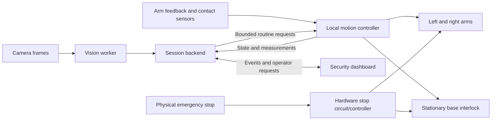

# Two-arm BracketBot bouncer: project plan

Updated September 12, 2026. Companion: [verified BracketBot commands](BRACKETBOT_COMMANDS.md).

## 1. Mission and current scope

Build a robot bouncer that conducts a **consensual, supervised physical pat-down with both arms**, uses vision and available contact sensing to gather observations, and presents object detections and screening events to a security operator on a dashboard.

The user explicitly confirmed physical contact with two arms. The project focuses exclusively on the BracketBot bouncer and its security dashboard.

The plan is not a completed implementation. The actual arms, joint limits, controller, force sensors, emergency-stop hardware, and robot networking details have not yet been identified. Hardware-dependent work is gated on those facts; dashboard, data contracts, recorded-image inference, and simulation can proceed immediately.

### What success looks like

A consenting participant enters the marked station, an operator starts a screening session, the stationary robot completes a validated two-arm contact routine, and the dashboard shows what was observed and what requires human review. A stop request or fault interrupts the routine without relying on a vision model or network response.

The system reports **observations**, such as a visible object detection or an unusual contact reading. It does not claim to prove someone is safe or dangerous, identify hidden objects from ordinary camera images, or certify a person as weapon-free.

## 2. What we have versus what we must build

| Component | Evidence / status | Work required |
|---|---|---|
| Wheeled BracketBot base | ODrive UART driver and drive demos in upstream repo | Adapt into one hardware-owning service; keep base stationary during contact. |
| Stereo camera | Capture, depth, YOLO and segmentation examples | Verify fitted camera; calibrate geometry and measure frame latency. |
| Two arms | User confirms two-arm pat-down concept | Record actual arm/controller models and obtain working control documentation. |
| Contact sensing | Not established | Identify force/torque/tactile sensing and its usable feedback rate. |
| Physical emergency stop | Not established | Confirm independent stop behavior on both arms and base. |
| Object recognition | Upstream YOLO example provides a starting point | Choose a small supported class set, collect demo examples, evaluate confusions. |
| Pat-down routine | Not present upstream | Develop hardware-specific, bounded contact routine and validate it progressively. |
| Dashboard | Not implemented | Build session view, evidence display, robot status and operator controls. |
| Session backend | Not implemented | Orchestrate state and events; persist minimal results. |

A generic hobby-servo position command is not evidence of controllable contact force. Motor-current estimates are not automatically calibrated force measurements. The hardware must support the contact behavior we intend to demonstrate.

## 3. Participant and operator flow

1. **Prepare:** the operator checks device status and clears the station. The base is stationary and arms are in a verified ready configuration.
2. **Explain and consent:** explain where contact will occur and how to stop. Consent can be withdrawn at any time. Use adult volunteers for the prototype.
3. **Position:** the participant stands at a marked location. Vision provides a coarse positioning check, while the operator confirms readiness.
4. **Start:** the operator explicitly authorises the contact routine for this session.
5. **Screen:** the robot executes a prevalidated sequence using both arms, with local contact monitoring and workspace limits. Using both arms does not require simultaneous inward squeezing; sequence and coordination depend on hardware validation.
6. **Observe:** vision detects supported visible objects; contact sensing records local measurements if suitable sensors exist. Unexpected readings cause a stop/review event, not extra probing.
7. **Finish:** execute the validated end-of-routine motion if conditions permit; show a completed summary.
8. **Review:** the operator inspects evidence and records a decision. An interrupted routine is labelled incomplete, not successful.

The initial contact envelope should be limited to explicitly consented, non-sensitive areas selected during hardware review. Exclude head, neck, chest/breasts, groin and any injured area. Do not improvise full-body trajectories from camera estimates.

## 4. System architecture



### Robot-side service

Owns all hardware connections. Reads camera and sensor timestamps, serialises wheel UART access, exposes health and bounded routine commands, and runs the contact controller locally.

The safety loop must remain effective if the laptop, dashboard, inference service, or Wi-Fi fails. Watchdog expiry, stale required feedback, limit violations and stop requests must be handled locally.

### Vision worker

Consumes timestamped frames, estimates whether the participant is in the designated area, and detects the supported object classes. It emits observations with source-frame references and model metadata. It must not issue arbitrary joint positions, force targets, or contact trajectories.

### Session backend

Tracks consent, operator authorisation, robot state, observations and review status. It rejects requests that are invalid for the current state. Duplicate or delayed requests must not replay a physical routine.

### Dashboard

Displays the active session and robot health, provides operator controls, and shows evidence. Its software stop button is an additional request path, not a replacement for a physical stop.

## 5. Motion state machine

| State | Behavior and permitted transition |
|---|---|
| `BOOTING` | Initialise and inspect hardware; no automatic contact motion. |
| `NOT_READY` | Missing calibration, failed sensors, unsupported arms, or another blocking condition. |
| `READY` | Validated hardware ready; arms in ready configuration; base stationary. |
| `AWAITING_CONSENT` | Explain interaction and record consent; contact disabled. |
| `POSITIONING` | Verify participant and workspace readiness. |
| `ARMED` | Operator authorises one session's routine after checks pass. |
| `SCREENING` | Run validated local routine with both arms and required live feedback. |
| `REVIEW_REQUIRED` | Routine completed or stopped with observations requiring inspection. |
| `COMPLETE` | Routine finished and summary saved; human review decision recorded separately. |
| `PROTECTIVE_STOP` | Fault, loss of readiness, participant stop, or unexpected contact; requires inspection and explicit reset. |
| `E_STOP` | Hardware emergency stop is active; software cannot resume by itself. |

The correct fault response depends on arm mechanics. Cutting power may let a gravity-loaded arm fall; freezing a position may maintain unwanted pressure. Define and verify the manufacturer's supported protective-stop behavior before human contact. Do not automatically retract after every fault: that movement can also create contact.

## 6. Two-arm pat-down development

### Hardware facts required first

- Arm and gripper/end-effector models; number of joints and degrees of freedom.
- Mount geometry, payload, reach, joint position/speed limits and controller protocol.
- Encoder feedback, force/torque/tactile sensors, feedback rates and disconnect behavior.
- Physical emergency-stop circuit and behavior under power loss.
- Mechanical compliance, padded contact surfaces and pinch/collision regions.
- Camera mounting and calibration between camera, base and both arms.

Do not invent numeric contact-force, speed or pressure limits. Derive them from the actual hardware documentation and an appropriate hardware review, then verify with measured contact. Broad limits copied from another robot are not sufficient.

### Validation sequence

1. Establish communication and read-only state reporting for both arms.
2. Validate homing/ready behavior with an empty workspace.
3. Validate bounded motion and mutual arm collision avoidance without a person.
4. Measure contact on an instrumented fixture or mannequin, including force overshoot and stopping behavior.
5. Inject feedback loss, stale camera frames, network loss, operator stop and emergency-stop conditions.
6. Verify the coordinated routine on the fixture repeatedly.
7. Only then consider a supervised, consenting human demonstration within the validated contact envelope.

If feedback or independent stopping is inadequate, continue the two-arm pat-down demonstration on a mannequin while improving hardware. Label this limitation clearly; do not present an unvalidated mannequin routine as human-ready.

### Proposed arm adapter interface

These are **new application interfaces**, not verified upstream commands:

```text
read_arm_state(side)
read_contact_state(side)
request_ready_pose()
validate_routine(routine_id, calibration_id)
start_routine(routine_id, session_id, authorisation_token)
request_protective_stop(reason)
read_stop_state()
```

A routine contains hardware-reviewed poses, permitted contact regions, joint/workspace limits, timing limits and contact constraints. The controller rejects stale or incompatible calibration. No model-generated code or free-form language command should bypass those constraints.

## 7. Vision, contact observations and percentages

### Keep three outputs distinct

| Output | Evidence required | Dashboard wording |
|---|---|---|
| Object classification | An object sufficiently visible in a camera frame | `Visible object: phone — model confidence 87%` |
| Contact anomaly | Validated contact sensor reading outside the routine's expected range | `Unexpected contact reading — operator review required` |
| Screening completeness | State-machine and telemetry records | `Completed` or `Interrupted / incomplete` |

An 87% model score is not an 87% probability of a weapon or an 87% chance a person is dangerous. Until evaluated and calibrated on representative examples, label it **model confidence**, and do not manufacture percentages for contact events.

Ordinary stereo/RGB vision cannot identify concealed items through clothing. Contact geometry by itself also does not establish an object's identity. If an unusual contact is detected, stop/refer for human review; if an object is voluntarily presented to the camera, classify the visible item separately.

Avoid a generic “abnormal person” score. Define concrete events such as person leaving the marked area, visual occlusion, unexpected contact, sensor failure, or a visible configured object class. Do not infer criminality from appearance, emotion, ethnicity, disability or body shape.

### Initial recognition scope

Start with a few clearly distinguishable, harmless demo objects, such as a phone, bottle and wallet, where labels are actually supported by the chosen model or training data. Do not assume the upstream general-purpose YOLO model recognises every prohibited-item class.

Include `unknown` or `uncertain` outcomes. Test lighting changes, occlusion and confusing objects. Store the model version and threshold configuration with results. If we later add a prohibited-object class, evaluate that class specifically before presenting it as supported.

### Inference pipeline

```text
Capture frame + timestamp
  -> reject stale frame
  -> detect participant / visible objects
  -> associate observations across a short time window
  -> apply configured confidence and visibility criteria
  -> attach evidence frame and model version
  -> publish observation to dashboard
```

Use temporal consistency to reduce repeated alerts, but keep detections tied to actual frames. Measure end-to-end latency on our equipment before choosing Pi-only versus laptop inference.

## 8. Security dashboard

### Main screen

- Live camera view with optional detection boxes and clear frame-age indicator.
- Robot state, connectivity, base interlock, arm readiness and contact sensor health.
- Session ID, consent status, elapsed time and routine progress.
- Observation cards with label, model confidence when available, timestamp and evidence.
- Separate routine completeness and human review status.
- Start, request stop and acknowledge-review controls, enabled only in valid states.
- Persistent stop/fault indication; no automatic resume after reconnect.

### Review panel

Show what triggered the observation and the supporting frame or contact measurement. Let the operator record `reviewed`, `needs follow-up`, or `false alert`, with a short note. Avoid automatic “safe person” or “dangerous person” labels.

Use short-lived random session IDs rather than face recognition. Keep demo data minimal and local by default. Make any recording explicit to participants and retain only what the demonstration needs.

## 9. Proposed backend contract

These routes are to be implemented; they are not the upstream MCP API.

| Route | Purpose |
|---|---|
| `GET /api/robot/status` | Hardware state, health and readiness blockers. |
| `POST /api/sessions` | Create an idle session. |
| `POST /api/sessions/{id}/consent` | Record explicit consent. |
| `POST /api/sessions/{id}/start` | Request one authorised, validated routine. |
| `POST /api/robot/stop` | Request local protective stop. |
| `GET /api/sessions/{id}` | Return observations and progress. |
| `POST /api/sessions/{id}/review` | Record operator review. |
| `WS /api/events` | Stream state and observation events. |

Require an authenticated operator for actuation and review actions, server-side state validation, command IDs, expiration, and deduplication. Keep hardware access exclusive to the local robot service.

Example observation; invented demonstration data, not a real inference:

```json
{
  "session_id": "demo-001",
  "event_id": "event-004",
  "type": "visible_object",
  "label": "phone",
  "model_confidence": 0.87,
  "model_version": "demo-model-v1",
  "source_frame_id": "frame-0124",
  "timestamp": "2026-09-12T17:00:00Z",
  "review_status": "pending"
}
```

A contact event should instead carry measured values, units, sensor identity and the triggering condition; use no object label or confidence unless a separately validated model supports them.

## 10. Implementation order

### Milestone 1: Identify hardware and establish the software skeleton

Record robot IP/user, both arm/controller models, sensors, calibration assets and stop hardware. Create a mock hardware adapter, session state machine and dashboard using synthetic events. Mock mode must be prominently labelled and unable to actuate hardware.

### Milestone 2: Live camera and visible-object observations

Integrate camera capture, timestamp frames and run a small object-detection demo. Display confidence and evidence without physical contact. Decide compute placement from measured latency.

### Milestone 3: Independent local motion and stop handling

Integrate the actual arm SDK/controller behind the adapter. Prove bounded empty-workspace movement, stationary-base interlock and fault handling. Remove inherited demo behavior that disables protection or leaves stale motion active.

### Milestone 4: Two-arm contact on a fixture

Implement and instrument the bounded routine. Validate contact readings, arm coordination, fixture contact limits, stopping and no automatic restart. Record measured results rather than relying on a successful-looking video.

### Milestone 5: End-to-end screening session

Connect consent, operator authorisation, local routine progress, observations, review and session summary. Demonstrate on the fixture; human contact remains conditional on the hardware validation above.

### Milestone 6: Demo polish and evaluation

Test a clean run, visible-object detection, uncertain observation, participant/fixture mispositioning, network loss and stop/restart flow. Prepare an honest demo showing supported behavior and limitations.

## 11. Tests that matter

| Test | Required outcome |
|---|---|
| Missing consent or operator authorisation | Contact routine cannot start. |
| Base interlock fails | Contact routine cannot start or continue. |
| Arm feedback becomes stale | Local protective response; dashboard reports incomplete session. |
| Laptop or network disconnects | Local controller remains responsible for stop behavior. |
| Duplicate start request | Routine is not replayed. |
| Emergency stop | Verified hardware-specific safe response; explicit reset required. |
| Reconnect after fault | State is restored accurately; no automatic motion. |
| Camera view is occluded | Observations marked unavailable/uncertain; no invented labels. |
| Unsupported visible object | Unknown/review outcome is possible. |
| Two-arm workspace conflict | Command rejected before entering an invalid configuration. |
| Mock mode | No hardware connections or actuation possible. |

Track recognition precision/recall on labelled demo examples, contact repeatability and overshoot on the fixture, fault stopping behavior, frame age, and session completion. Do not use a single combined “security accuracy” metric to hide these different capabilities.

## 12. Suggested project layout

```text
BRACKETBOT_COMMANDS.md
BOUNCER_ROBOT_PLAN.md
robot/
  service.py
  hardware/
    base.py
    arms.py
    contact.py
    mock.py
  routines/
  controller.py
vision/
  capture.py
  detector.py
backend/
  sessions.py
  events.py
dashboard/
config/
tests/
```

This is a proposed structure, not existing files. Choose exact frameworks when implementation starts. The reviewed repo is primarily Python; upstream camera and ODrive pieces can be adapted, while the arm adapter and dashboard are new work.

## 13. Current decisions and unresolved items

Confirmed:

- BracketBot bouncer robotics only.
- Bouncer/security concept with a physical two-arm pat-down.
- Vision/object recognition and security dashboard.
- Show model confidence where meaningful and concrete reviewable observations.

Unresolved:

- Actual arms/controllers, contact sensing and stop hardware.
- Whether the robot already has working arm-control software outside public quickstart.
- Participant contact envelope and hardware-reviewed routine.
- Hackathon deadline, available team members and compute equipment.
- Supported object classes, labelled demo data and any external inference service.

**Next implementation dependency:** identify the two arms and their controller. In the meantime, the mock session flow, dashboard and visible-object pipeline can be built without inventing hardware capabilities.
